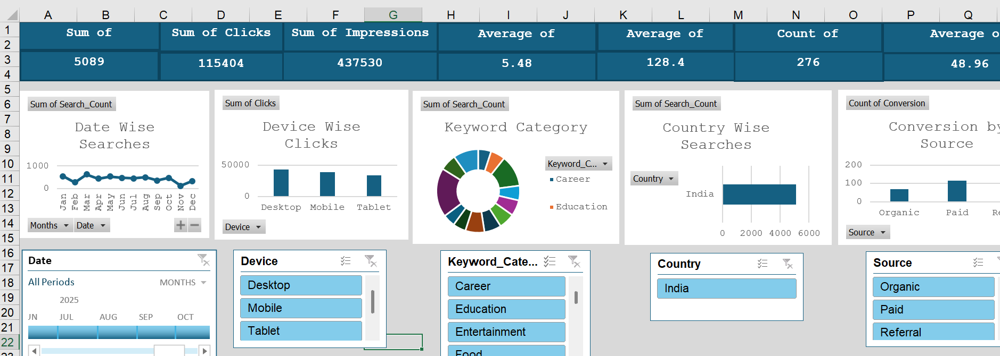
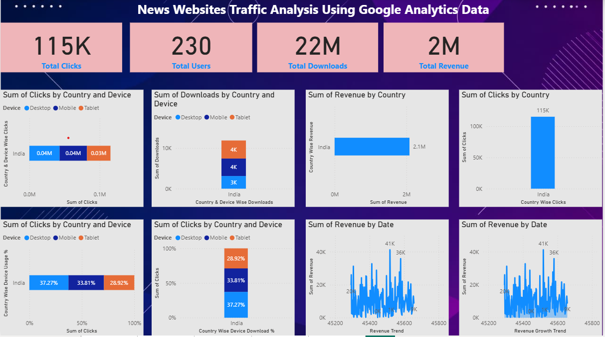
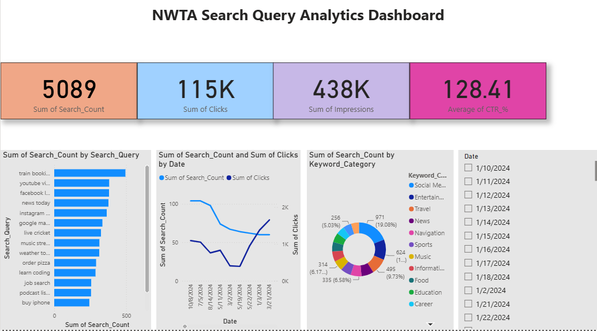
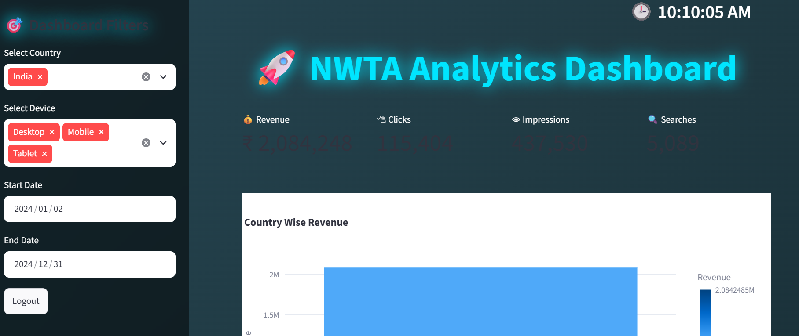

# News Websites Traffic Analysis Using Google Analytics Data

## Project Overview
This project analyzes news website traffic data to understand user engagement, traffic sources, searches, clicks, page views, and revenue.

## Project Objective
To analyze Google Analytics data to understand website traffic, user behavior, engagement, traffic sources, clicks, page views, and revenue, and to present meaningful insights through interactive dashboards using Excel, Power BI, SQL, and Python.

## Tools & Technologies
- Excel
- Power BI
- Python
- SQL

## Key Analysis
- Date-wise search analysis
- Device-wise clicks
- Country-wise searches
- Keyword category analysis
- Traffic source analysis
- User engagement and revenue analysis

 ## Dashboard

 ## Excel Dashboard

## Power BI Dashboard

## SQL Dashboard

## Python Dashboard

## Project Outcome

- Identified website traffic and user engagement trends.
- Analyzed clicks, searches, revenue, devices, countries, and traffic sources.
- Created dashboards using Excel, Power BI, Python, and SQL.

 ## Dataset

The dataset contains website traffic and user engagement information used for analysis and visualization.

## Dataset
The dataset contains website traffic and user engagement information used for analysis and visualizatio
